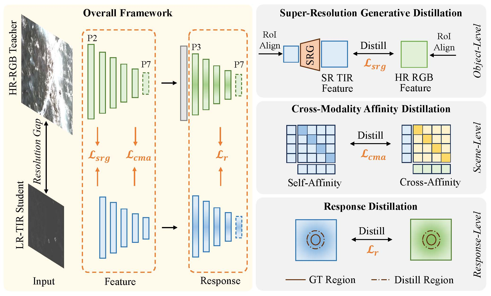
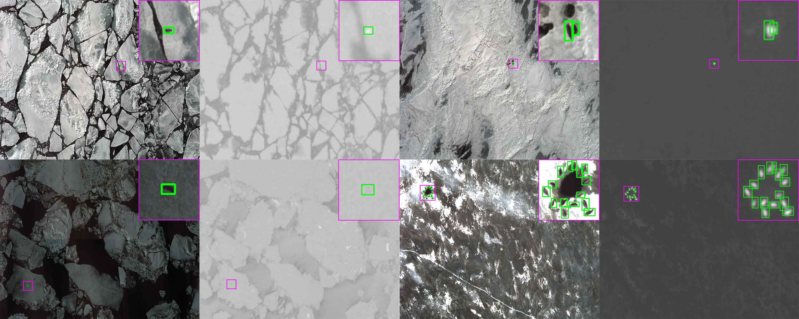

# CMHRD

Official code for "Learning Cross-Modality High-Resolution Representation for Thermal Small Object Detecion".



# Prerequisites

Python=3.8

PyTorch=1.12.1

MMCV=1.7.1

MMDetection=2.28.2

# Data

NOAA-Seal dataset [Baidu Netdisk](https://pan.baidu.com/s/1n9uznb4ewSr_N2Qoz-ZMNQ?pwd=gkw3) (Extraction code: gkw3)



If you use NOAA-Seal in your work, please cite us and also cite:
```
@misc{noaa,
  title={A Dataset for Machine Learning Algorithm Development},
  author={Alaska Fisheries Science Center},
  year={2023},
  note={https://www.fisheries.noaa.gov/inport/item/63322}
}
```
# Run
Train HR-RGB teacher:
```
python train.py cmhrd_configs/atss_r50_fpn_p3_qls_1x_noaa_v.py
```

Train CMHRD:
```
python train.py cmhrd_configs/atss_r50_fpn_p3_qls_2x_cmhrd_noaa.py
```

Test CMHRD:
```
python test.py cmhrd_configs/atss_r50_fpn_p3_qls_2x_cmhrd_noaa.py /path/to/pth/ --eval bbox
```
